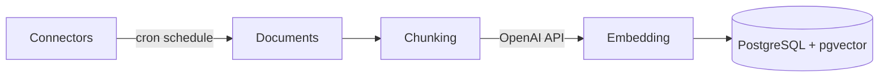
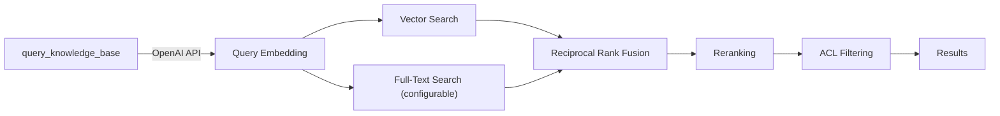

<!--
Check ../docs_writer_prompt.md before changing this file.

-->

Knowledge bases provide built-in retrieval augmented generation (RAG) powered by PostgreSQL and pgvector. Connectors sync data from external tools into knowledge bases, where documents are chunked, embedded, and indexed for hybrid search. Agents query their assigned knowledge bases at runtime via the `query_knowledge_base` tool.

> **Enterprise feature.** Knowledge bases require an enterprise license. Contact sales@archestra.ai for licensing information.

## Architecture

The RAG stack runs entirely within PostgreSQL — no external vector database required. See [Platform Deployment — Knowledge Base Configuration](/docs/platform-deployment#knowledge-base-configuration) for full configuration reference.

### Ingestion

Connectors run on a cron schedule, pulling documents that are chunked and embedded into PostgreSQL with pgvector.

### Querying

At runtime, the `query_knowledge_base` tool embeds the query, runs vector and optional full-text search in parallel, then fuses, reranks, and filters results.

## LLM Provider Configuration

Embedding and reranking require LLM provider API keys. These are configured in **Settings > Knowledge** by selecting existing LLM Provider Keys -- no environment variables are needed. Both must be configured before knowledge bases and connectors can be used.

### Embedding

Only OpenAI embedding models are supported. The selected API key must have access to the configured embedding model (`text-embedding-3-small` or `text-embedding-3-large`; both models are reduced to 1536 dimensions for the `pgvector` index).

The embedding model is locked after documents have been embedded, and changing it is not currently supported (as changing models requires re-embedding all documents).

### Reranking

The reranker uses an LLM to score and reorder search results by relevance. Any LLM provider and model can be used -- the model should support structured output.

## Connectors

Connectors pull data from external tools (Jira, Confluence, etc.) on a schedule. Each connector tracks a checkpoint for incremental sync -- only changes since the last run are processed. A connector can be assigned to multiple knowledge bases.

See [Knowledge Connectors](/docs/platform-knowledge-connectors) for supported connector types, configuration, and management.

## Assigning Knowledge Bases

Knowledge bases can be assigned to Agents and MCP Gateways. An Agent can have multiple knowledge bases, and a knowledge base can be shared across agents.

### Visibility Modes

| Mode                      | Behavior                                                        |
| ------------------------- | --------------------------------------------------------------- |
| **Org-wide**              | All documents accessible to all users in the organization       |
| **Team-scoped**           | Documents accessible only to members of the assigned teams      |
| **Auto-sync permissions** | ACL entries synced from the source system (user emails, groups). *Coming soon — see [#3218](https://github.com/archestra-ai/archestra/issues/3218).* |
